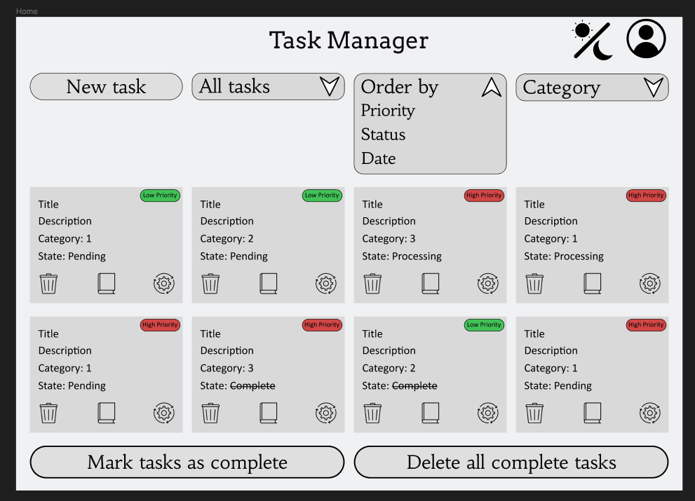

# Proyecto Vue: Task manegment

## Idea del proyecto
Mirando en los ejemplos que dio para la propuesta de proyecto se me ocurrio hacer una task manegment para crear y organizar tus tareas, con la finalidad de ayudar a aquellas personas que cuesta organizar las cosas que deben de ir haciendo, teniendo funcionalidades como la importancia de la tarea, categorias, filtrar el estado de tareas, etc.

## Propuesta y Conceptualización

### Definición de Funciones
La propuesta se centra en el desarrollo de funciones personalizadas para interactuar con la API de TodoList en un entorno Vue.js. Se establecerá una conexión clara y directa con la API para realizar estas operaciones. Ejemplos de funciones incluyen:

- **Crear Tarea:**
  - Definir una función que tome los datos necesarios desde la interfaz de usuario y realice una solicitud a la API de TodoList para agregar una nueva tarea.

- **Actualizar Estado de Tarea:**
  - Crear una función que permita cambiar el estado de una tarea (completada, pendiente) y reflejar ese cambio en la API de TodoList.

- **Eliminar Tarea:**
  - Desarrollar una función que gestione la eliminación de una tarea seleccionada, interactuando con la API de TodoList para reflejar dicha eliminación.

- **Modificar Tarea:**
  - Implementar una función que te lleve a la interfaz de creadion con las modificaciones correspondientes para que sea editar la tarea seleccionada.

- **Recuperar Listas de Tareas:**
  - Implementar una función que obtenga las listas de tareas disponibles a través de la API de TodoList, facilitando la visualización de información relevante.

- **Filtrar Listas de Tareas:**
  - Realizar función que obtenga las listas de tareas disponibles a través de la API de TodoList, filtrandola mediante diversas caracteriasticas, como el estado, prioridad, categoria... .

## Base realizada en Figma:

[Enlace Figma](https://www.figma.com/file/BGaKQrkexlQIjpmLp58o66/Task-Manager?type=design&node-id=1%3A2&mode=design&t=ug5M0ZaEtpbGrVLc-1)

### Estructura de Objetos
La estructura de objetos se adapta a la arquitectura de Vue.js, incorporando componentes que representen tareas, proyectos y listas de tareas. Estos objetos se integrarán en la lógica del proyecto, permitiendo una gestión eficiente de la información.

- **Componente Tarea:**
  - Crear un componente que represente una tarea individual, con propiedades como id, nombre, estado y fecha de vencimiento.

- **Componente Proyecto:**
  - Diseñar un componente para mostrar y gestionar proyectos, con propiedades como nombre del proyecto y lista de tareas asociadas.

- **Componente Lista de Tareas:**
  - Desarrollar un componente que presente listas de tareas, permitiendo la interacción con diferentes conjuntos de tareas.

### Planificación de Implementación
La implementación se planificará considerando la interacción con la API de TodoList y la integración de funciones y objetos en el flujo de la aplicación Vue.js. Se establecerán rutas y componentes para una navegación fluida entre vistas, asegurando una experiencia de usuario coherente.

- **Configuración de Rutas:**
  - Definir rutas para las diferentes vistas, como la lista de tareas, detalles de la tarea, y gestión de proyectos.

- **Integración con API:**
  - Establecer métodos en los componentes para interactuar directamente con la API de TodoList, asegurando una integración efectiva.

- **Manejo de Estados:**
  - Utilizar Vuex para gestionar estados de la aplicación de manera eficiente, garantizando una representación precisa de los datos.

## Gestión de Eventos

### Planificación de Eventos
La planificación de eventos se enfocará en las operaciones clave de la aplicación, como la creación de tareas, actualización de estados y eliminación de tareas. Se diseñará una estructura de eventos para manejar estas acciones de manera efectiva.

- **Eventos de Creación:**
  - Establecer eventos para la creación de nuevas tareas, asegurando una comunicación efectiva entre componentes y la API de TodoList.

- **Eventos de Actualización:**
  - Definir eventos que manejen las actualizaciones de estado de las tareas, sincronizando la información en tiempo real.

- **Eventos de Modificación:**
  - Planificar eventos para poder modificar la informacion de la tarea seleccionada, garantizando una respuesta inmediata en la interfaz de usuario.

- **Eventos de Eliminación:**
  - Planificar eventos para gestionar la eliminación de tareas, garantizando una respuesta inmediata en la interfaz de usuario.

## Anotaciones Futuras

Tambien tengo la intencion si dispongo del tiempo de a parte de usar la API TodoList utilizar otras APIs yextensiones de bue para por ejemplo:

- **Vinvular Calendario**
  - Tengo la intencion de intentar utilizar la API de google calendars para que pueda vincular las tarea con el calendario del usuario.

- **Agregar categorias**
  - Estoy tratando de buscar una API que permita hacer llamados y obtengan un icono de lo solicitado y suarlo para divdir las tareas por categorias y poder hacer dicho filtrado.