# Informe de accesibilidad

## W3C

En esta imagen se puede ver que mediante w3c la validacion de la estrucctura y contenido en general del css es valido, aunque despues se ve que tengo 16 advertencias aunque todas son relacionada a los que coloras que tengo en variables ya que son de naturaleza dinámica y no se han podido analizar estaticamente.

## TAW

Taw se encarga de analizar el css de forma que sea accesible para todos en lugar de solo ver la estruccturaciones y funcionalidades como w3c, en mi informe se ve que no tengo ningun error grabe pero si varias advertencias (11) de accesibilidad y 22 que no pueden ser verificados por el sistema y esto es debido a que unicamente puede analizar la parte del fontend ya que no emos podido desplegar el backend, causando que solo pueda analizar aquello que no requiera de llamadas a la API.

Luego los analisis se dividen en varias secciones (la definicion de cada una esta en la captura de pantalla) que son:
### Perceptibles
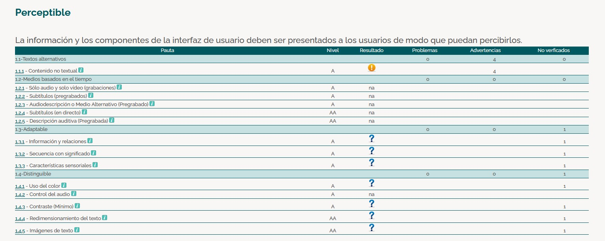

### Operables
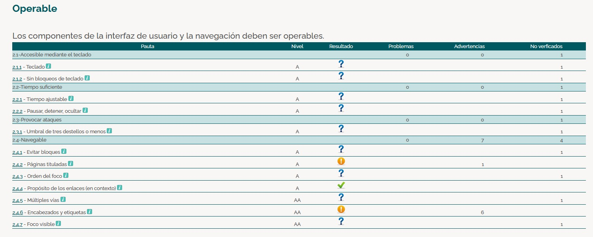

### Comprensibles y Robustos
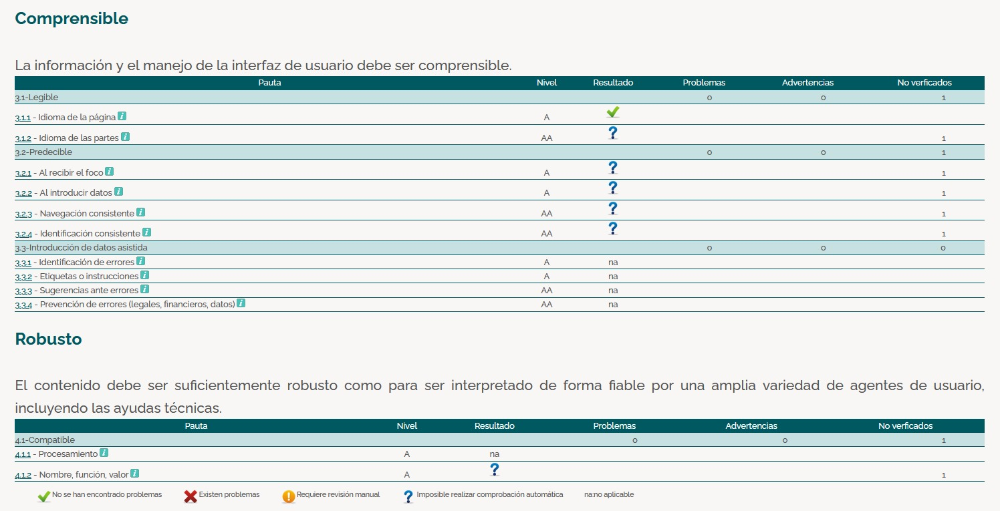

Como analisis genreal las advertencias que me dan es porque en las paginas me faltan titulos y encabezados de los elementos

## WAVE

Con esta extension de microsoft te da un informe menos detallado que Taw pero te va mostrando en cada pagina en la que estes los diversos errores, advertencias, contrastes, etc. El resultado de mi analisis con esta extension pagina a pagina es:

### Home
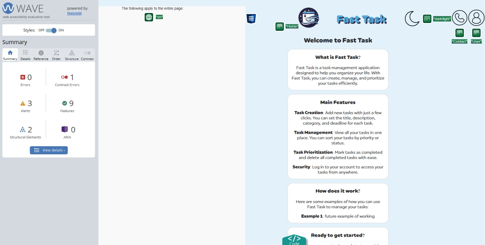
### Tasks
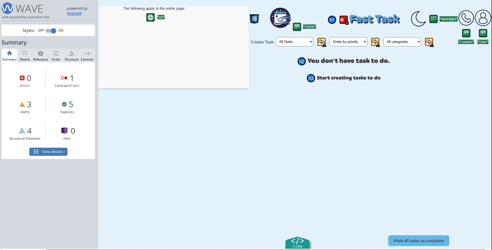
### Tasks con Contenido
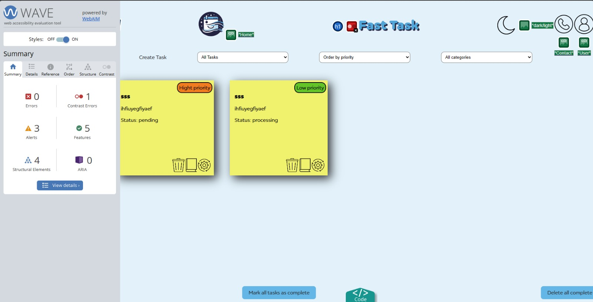
### Formulario de tareas
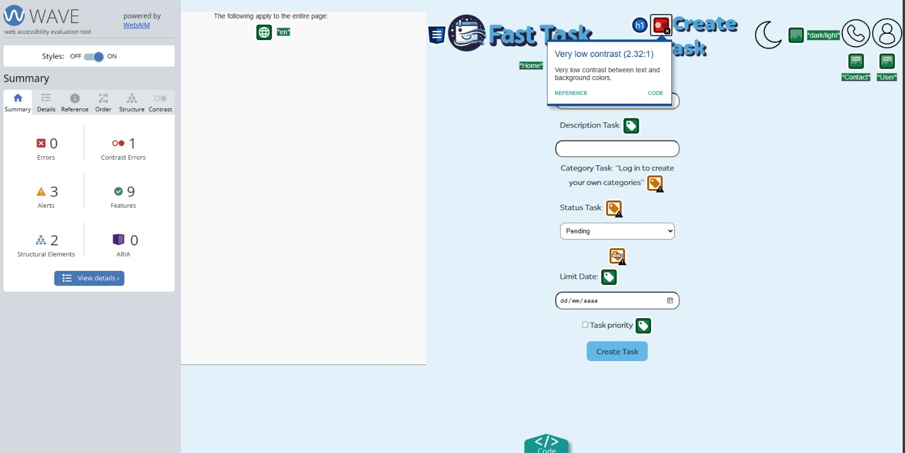
### Contacto
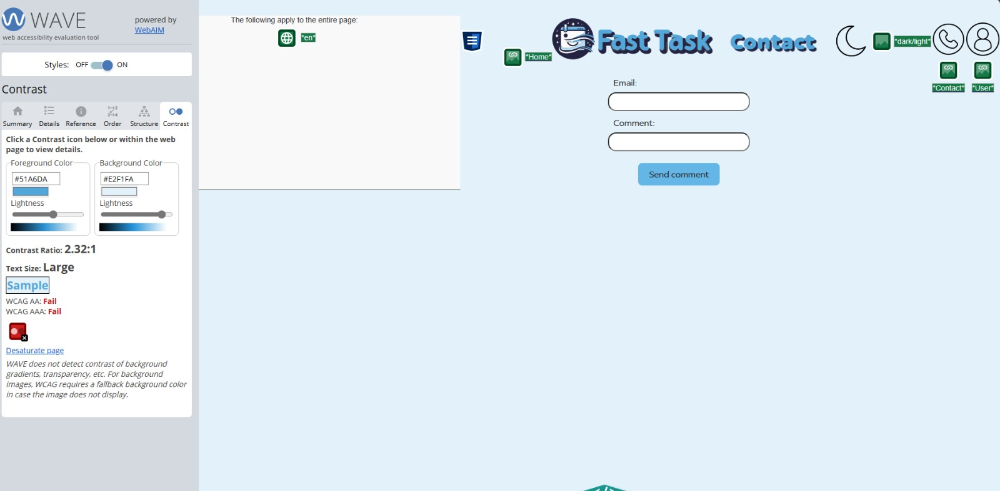
### Login y Crreacion de Cuentas
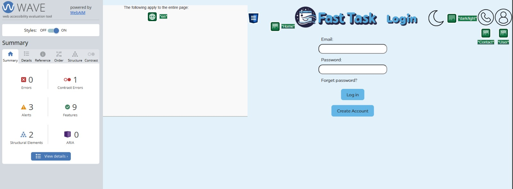
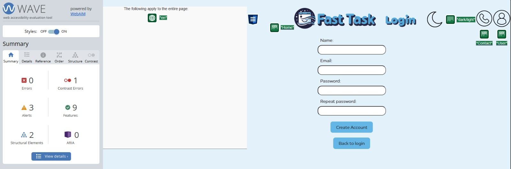
### User Data
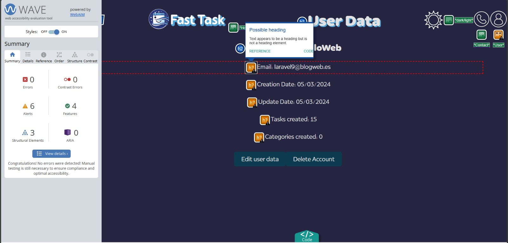
### User Categories
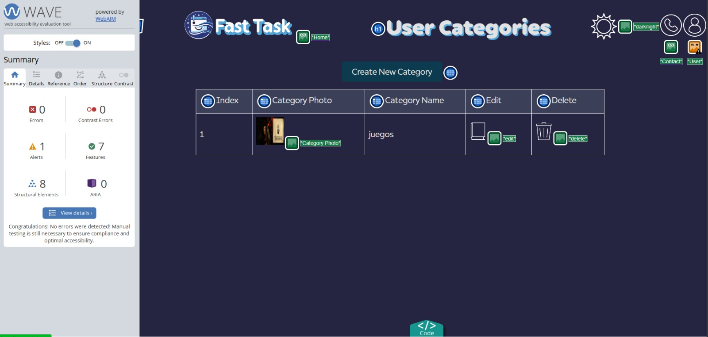

Basicamente los avisos que me salen aqui sin cuando el tema esta en modo claro por el contraste respecto el fondo que hay poco contraste y unos avisos en los selects porque no hay nada para que indiquen de que son esos selects, es decir no tienen su label introductorio, en la informacion de los usuarios wave da como sugerencia que ponga como headings los datos del usuario y en el navbar me da una alerta porque el texto alternativo de la imagen es igual a uno de los elementos internos al menu desplegable.

## Modificaciones en el codigo

### Titulos y encabezados
Eso no lo he modificado por el echo de que utilizo el navbar como el encabezado teniendo ahi el titulo de cada pagina y aunque es una mala practica no se me ocurria otra forma de poner el navbar.

### Contraste
El contraste lo he solucionado utilizando un color mas oscuro para los titulos. (He usado el color sugerido por el sistema)

### Coincidencia de datos
He modificado el texto alternativo para que concuerda mas con que es cada foto.
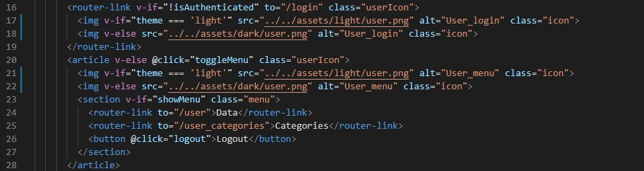