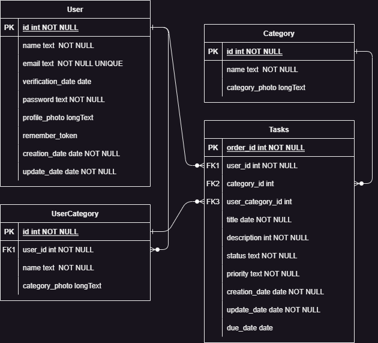

# Proyecto: Task Manager Vue App

## Índice de Contenido

- [3. Introducción, Expectativas/Objetivos y Antecedentes](#3-introducción-expectativas-objetivos-y-antecedentes)
- [4. Descripción](#4-descripción)
- [5. Instalación y Preparación](#5-instalación-y-preparación)
- [6. Guía de Estilos y Prototipado](#6-guía-de-estilos-y-prototipado)
- [7. Diseño](#7-diseño)
- [8. Desarrollo](#8-desarrollo)
- [9. Pruebas](#9-pruebas)
- [10. Despliegue](#10-despliegue)
- [11. Manual](#11-manual)
- [12. Conclusiones](#12-conclusiones)
- [13. Índice de Tablas e Imágenes](#13-índice-de-tablas-e-imágenes)
- [14. Bibliografía y Referencias](#14-bibliografía-y-referencias)

## 3. Introducción, Expectativas/Objetivos y Antecedentes

Mi proyecto es una task manegment para crear y organizar tus tareas, con la finalidad de ayudar a aquellas personas que cuesta organizar las cosas que deben de ir haciendo, teniendo funcionalidades como la importancia de la tarea, categorias, filtrar el estado de tareas, etc.

## 4. Descripción

He logrado realizar bastantes funcionalidades de las que propuse en la idea inicial, como por ejemplo a parte de las basicas de creacio, eliminacion y edicion de tareas, tambien estan creadas esas funcionalidades para categorías personalizadas que pueden hacer los usuarios registrados en la aplicacion y aunque no pude vincular la aplicacion con calendarios si he creado una pequeña funcion que te muestra el tiempo restante para terminar la tarea, a pesar de las dificultades de organizacion que he tenido debido a tener que realizar este proyecto practicamente para todas las asignaturas cada una su respectiva sección.

## 5. Instalación y Preparación

Pasos detallados sobre cómo instalar y preparar el proyecto:

- Clonar el repositorio desde GitHub.
- Despliegue del docker del backend.
- Instalar dependencias con `npm install`.
- Inicia la aplicación: `npm run dev`.

## 6. Guía de Estilos y Prototipado

### Fuentes

- **Title:** [PromoTest-Bold](../assets/fonts/PromoTest-Bold-BF63b788015fdbf.otf)
- **Text:** [PromoTest-Normal](../assets/fonts/PromoTest-Normal-BF63b78802deb68.otf)

### Paleta de Colores

#### Modo Claro ([data-theme="light"])

- **Background Color:** #e2f1fa
- **Text Color:** #2c2d30
- **Text Color Hover:** #00afe4
- **Button Background Color:** #63b6e6
- **Button Background Color Hover:** #2890bd
- **Title Color:** #51a6da
- **Shadow Color:** #242543
- **Menu Background Color:** #ffffff
- **Border Color:** #d3d3d3

#### Modo Oscuro ([data-theme="dark"])

- **Background Color:** #252441
- **Text Color:** #e2e2e2
- **Text Color Hover:** #c3fbff
- **Button Background Color:** #0c3b50
- **Button Background Color Hover:** #081b23
- **Title Color:** #e2e2e2
- **Shadow Color:** #51a6da
- **Menu Background Color:** #3c3f58
- **Border Color:** #ffffff

### Estructura de la Página

- **Body:**
  - Background: var(--background-color)
  - Color: var(--text-color)
  - Margin: 30px
  - Display: flex

- **#app:**
  - Width: 100%
  - Text Align: center

### Encabezados y Texto Fuerte

- **h2, h3, strong:**
  - Font Family: "Title"

### Navegación

- **.router:**
  - Color: var(--text-color)
  - Text Decoration: inherit

- **.router:hover:**
  - Color: var(--text-color-hover)

### Sección de Datos de Inicio

- **.homeData:**
  - Width: 50%
  - Background Color: var(--menu-bg-color)
  - Border: 1px solid var(--border-color)
  - Border Radius: 20px
  - Margin: 0 auto 15px
  - Padding: 0 15px

### Botones

- **button:**
  - Border Radius: 8px
  - Border: 1px solid transparent
  - Padding: 0.6em 1.2em
  - Font Size: 1em
  - Margin Top: 10px
  - Color: var(--text-color)
  - Font Weight: 500
  - Font Family: inherit
  - Background Color: var(--bt-background-color)
  - Cursor: pointer
  - Transition: border-color 0.25s

- **button:hover:**
  - Border Color: #646cff
  - Background Color: var(--bt-background-color-hover)

- **button:focus, button:focus-visible:**
  - Outline: 4px auto -webkit-focus-ring-color

### Tamaños Responsivos

- **@media screen and (max-width: 800px):**
  - Body Margin: 20px
  - button Padding: 0.4em 1em
  - button Font Size: 0.9em

- **@media screen and (max-width: 600px):**
  - Body Margin: 10px
  - button Padding: 0.2em 0.8em
  - button Font Size: 0.8em

## 7. Diseño

## 8. Desarrollo

El dessarrollo de mi aplicacion fue:

1. Creación de las rutas y paginas de base.
2. Empezar las funcionalidades para aquellos usuarios no registrados.
3. Backend utilizando larvel.
4. Implementacion del backend en el programa.
5. Refactorizacion de codigo.
6. Implementación de pinia en el codigo.
7. Creación de los elementos de docker para el despliegue.

## 9. Pruebas

Descripción de las pruebas realizadas, enfoque de pruebas unitarias y, si es posible, automatización de pruebas.

## 10. Despliegue

Despliegue realizado localmente.

## 11. Manual

### Home

El home es la primera pagina que se te muestra si entras por primera vez, si ya estabas registrado vas directamente a tasks, y en esta pagina se te da una introduccion a la aplicacion y te da la opcion de iniciar la aplicacion con una version de prueba.

### Login

Es un login como todos los demas donde inicias sesion o en sus defectos darle a recordar contraseña o crear un nuevo usuario.

### Tasks

Aqui es donde se muestran todas las tareas que ha creado el usuario, permitiendote filtrarlas u ordenarlas por ciertos criterios y ya cada tarea tiene su propia configuracion como eliminarla, editarla, modificar el estado de la tareo o cambiar su prioridad.

### Tasks Form

Con este formulario podemos crear nuevas tareas o editar la tarea que hubieramos seleccionado, pero tambien tiene la peculiaridad para aquillos que esten registrados en la aplicacion de crear categorias personalizadas.

### User Data

Muestra la informacion del usraurio y tambien da opcion de editar esa informacion o de eliminar su cuenta.

### User Categories

En esta tabla se recopilan todas las categorias que haya creado el usuario con opciones de editar o eliminar una categoria en especifico o de crer nuevas categorias.

### Contact

La clasica pagina de contactos donde informas de cualquir complicacion al dueño de la aplicacion

## 12. Conclusiones

Por la cantidad de tiempo y el echo de que habia que realizar el programa de forma conjunta con las 4 asignaturas procuraba no alejarme mucho de la idea inical y centrarme en que funsionase correctamente, los unicos ajuste que se salian de la idea inicial eran aquellas sugerencias dadas por los profesores, lo aprendido con este proyecto es:
- Creacion de proyectos y manejo de Laravel.
- Despliegue de elementos docker.
- Diseño de la aplicación, accesibilidad y responsive.
- Manejo de vue y algunos complementos pertenecientes a él.

### Mejoras futuras

Como objetivo principal debo mejorar mi organizacion y adaptabilidad a imprevistos en el codigo, ya dentro del codigo algunas mejoras a realizar serían:
- Refactorizar el código
- Mejoras en el diseño y responsive.
- Implementación de calendario como sugeri en la idea de proyecto pero no me dio tiempo.

## 13. Índice de Tablas e Imágenes

Incluir un índice que enumere las tablas e imágenes utilizadas en la documentación.

## 14. Bibliografía y Referencias

[Documentacion Vue: silver-succotash](https://silver-succotash-n1q835e.pages.github.io/docs/referencias/ud8/)
